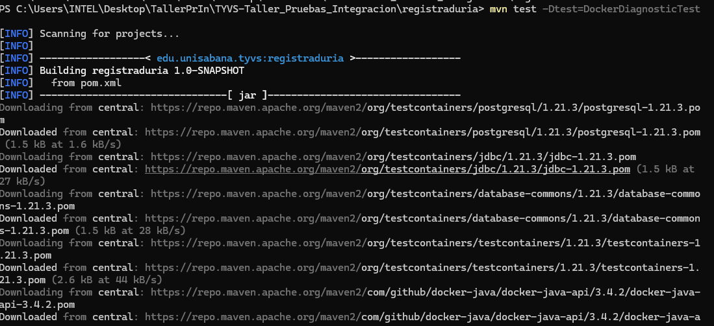
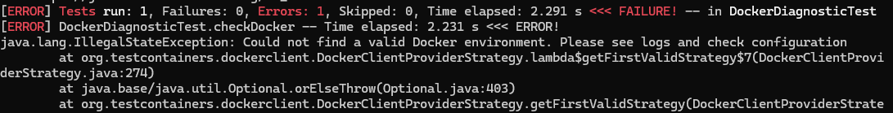
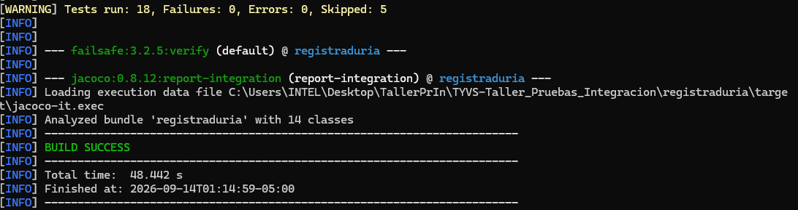

# defectos.md

Registro de defectos detectados durante el desarrollo y ejecución de las
pruebas de integración y sistema del proyecto `TYVS-Taller_Pruebas_Integracion`.

---

## Defecto 01 — Testcontainers no detecta el daemon de Docker

- **Caso probado:** `RegistryRepositoryPostgresIT` (5 pruebas: registro válido/duplicado
  contra PostgreSQL real, ida-vuelta de datos, nombre demasiado largo, y divergencia
  de plegado de identificadores H2 vs. PostgreSQL).
- **Resultado esperado vs. obtenido:**
  Esperado: las 5 pruebas se ejecutan contra un contenedor PostgreSQL real y pasan.
  Obtenido: las 5 pruebas se **saltan** (`Skipped`) en cada ejecución de `mvn clean verify`.
  `DockerClientFactory.instance().isDockerAvailable()` evalúa `false` desde el proceso
  de Maven, aunque `docker version` responde correctamente desde PowerShell (cliente
  y servidor de Docker Desktop 4.90.0 activos).
- **Causa probable:** desajuste entre el contexto de Docker visible para la terminal
  (PowerShell) y el visible para el proceso Java/Maven — típico en Windows con Docker
  Desktop + WSL2 cuando la variable `DOCKER_HOST` o el contexto activo (`docker context ls`)
  no está expuesto al proceso que lanza Maven. No se confirmó si Maven corre desde
  PowerShell nativo, WSL o un IDE con su propio entorno de variables.
- **Estado:** Abierto.
- **Evidencia:** 
- 
- 
- Y ahora cuando se corría mvn clean verify:
- 